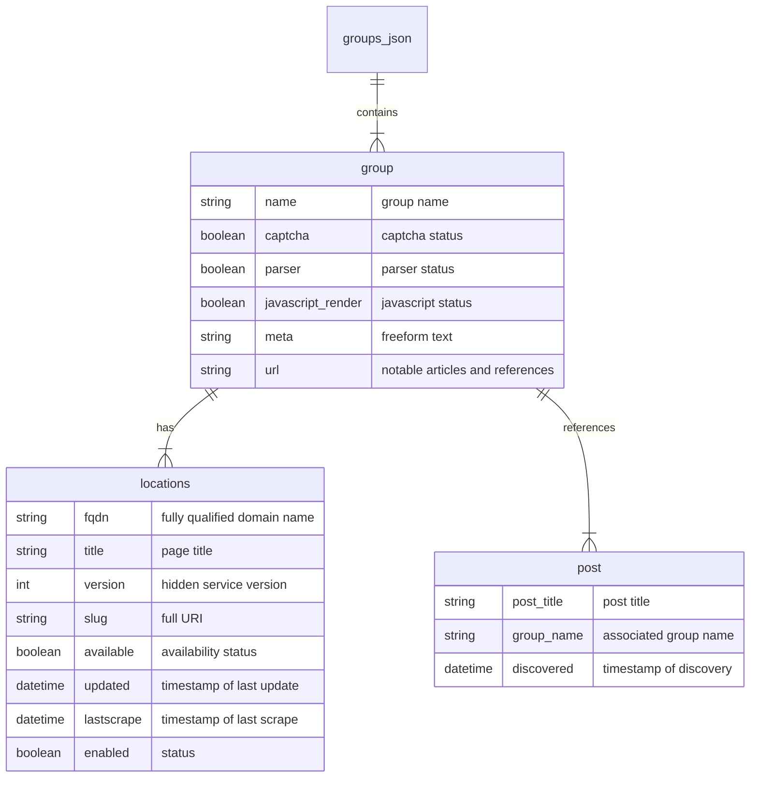

<!--
looking for historical data? 
check ransomwatch-history - https://github.com/joshhighet/ransomwatch-history
-->
<div align="center">
<h1>
  <a href="https://ransomwatch.telemetry.ltd">
    ransomwatch 👀 🦅
  </a>
</h1>
</div>
<p align="center">
  <a href="https://github.com/joshhighet/ransomwatch/actions/workflows/ransomwatch.yml">
    
  </a>
  <a href="https://github.com/joshhighet/ransomwatch/actions/workflows/ransomwatch-build.yml">
    
  </a>
  <a href="https://github.com/joshhighet/ransomwatch/actions/workflows/codeql-analysis.yml">
    
  </a>
</p>

ransomwatch trails the extortion sites used by ransomware groups and surfaces an aggregated feed of claims

please use the [_issue template_](https://github.com/joshhighet/ransomwatch/issues/new?assignees=&labels=✨+enhancement&template=newgroup.yml&title=new+group%3A+) when making submissions for new groups

---

<h4 align="center">⚠️</h4>

_content within `ransomwatch.telemetry.ltd`, `posts.json`, `groups.json` alongside the `docs/` & `source/` directories is dynamically generated based on hosting choices of real-world threat actors in near-real-time._

_whilst sanitisation efforts have been taken, by viewing or accessing ransomwatch you acknowledge you are doing so at your own risk_

##### if you leverage ransomwatch in commercial platforms, please consider becoming a [sponsor](https://github.com/sponsors/joshhighet) 💞

---

### key outputs

`web://` [`ransomwatch.telemetry.ltd`](https://ransomwatch.telemetry.ltd)

`json://` [`ransomwhat.telemetry.ltd/posts`](https://ransomwhat.telemetry.ltd/posts)

`json://` [`ransomwhat.telemetry.ltd/groups`](https://ransomwhat.telemetry.ltd/groups)

- _`groups.json` contains hosts, nodes, relays and mirrors for a tracked group or actor_
- _`posts.json` contains extracted posts, noted by their discovery time and accountable group_


## technicals

this is a live repository which leverages a combination of github actions and a [service container](https://docs.github.com/en/actions/using-containerized-services/about-service-containers) to visit, parse & report on monitored hosts in near-realtime in a self-contained manor.

content fetching is done with [psf/requests](https://github.com/psf/requests) - if rendering is required [mozilla/geckodriver](https://github.com/mozilla/geckodriver) and [seleniumhq/selenium](https://github.com/SeleniumHQ/selenium) are leveraged.

the frontend is ultimatley markdown, generated with [markdown.py](https://github.com/joshhighet/ransomwatch/blob/main/markdown.py) and served with [docsifyjs/docsify](https://github.com/docsifyjs/docsify) thanks to [pages.github.com](https://pages.github.com)

graphs or visualisations are generated with [plotting.py](https://github.com/joshhighet/ransomwatch/blob/main/plotting.py) with the help of [matplotlib/matplotlib](https://github.com/matplotlib/matplotlib)

post indexing is done with a mix of `grep`, `awk` and `sed` within [parsers.py](https://github.com/joshhighet/ransomwatch/blob/main/parsers.py) - it's brittle and like any  ̴̭́H̶̤̓T̸̙̅M̶͇̾L̷͑ͅ ̴̙̏p̸̡͆a̷̛̦r̵̬̿s̴̙͛ĩ̴̺n̸̔͜g̸̘̈, has a limited lifetime.

## tools

rendered HTML for each page is viewable within the [source](https://github.com/joshhighet/ransomwatch/tree/main/source) directory

- [screenshotter.py](https://github.com/joshhighet/ransomwatch/blob/main/assets/screenshotter.py) _a playwright script to generate high-resolution screenshots of online hosts_
- [srcanalyser.py](https://github.com/joshhighet/ransomwatch/blob/main/assets/srcanalyser.py) _a basic extractor for emails, internal and external links found within page source_
- [browse-hosts.sh](https://github.com/joshhighet/ransomwatch/blob/main/assets/browse-hosts.sh) _a simple cURL based iterator for sweeping URL checks_
- [sources.zsh](https://github.com/joshhighet/ransomwatch/blob/main/assets/sources.zsh) _an aggregator of various locations that surface new groups for ransomwatch_
- [uptimekuma-importer.py](https://github.com/joshhighet/ransomwatch/blob/main/assets/uptimekuma-importer.py) _a script to convert the group data into a [uptime-kuma](https://github.com/louislam/uptime-kuma) configuration file_
- [parsers.sh](https://github.com/joshhighet/ransomwatch/blob/main/assets/parsers.sh) _a health-check script that provides details on parsers that are returning no fields_

## cli operations

_fetching hidden services requires a tor circuit! establish one with;_

```shell
docker run -p9050:9050 ghcr.io/joshhighet/torsocc:latest
```

```shell
➜  ransomwatch git:(main) ✗ ./ransomwatch.py --help

       _______________                        |*\_/*|________
      |  ___________  |                      ||_/-\_|______  |
      | |           | |                      | |           | |
      | |   0   0   | |                      | |   0   0   | |
      | |     -     | |                      | |     -     | |
      | |   \___/   | |                      | |   \___/   | |
      | |___     ___| |                      | |___________| |
      |_____|\_/|_____|                      |_______________|
        _|__|/ \|_|_.............💔.............._|________|_
       / ********** \                          / ********** \
     /  ************  \     ransomwhat?      /  ************  \
    --------------------                    --------------------

usage: ransomwatch.py [-h] [--name NAME] [--location LOCATION]
                      [--append APPEND]
                      {add,append,scrape,parse,list,markdown,check}

👀 🦅 ransomwatch

positional arguments:
  {add,append,scrape,parse,list,markdown,check}
                        operation to execute

options:
  -h, --help            show this help message and exit
  --name NAME           provider name
  --location LOCATION   onionsite fqdn
  --append APPEND       add onionsite fqdn to existing record
```

## datamap


---

_ransomwatch is [licensed](https://github.com/joshhighet/ransomwatch/blob/main/LICENSE) under [unlicense.org](https://unlicense.org)_
